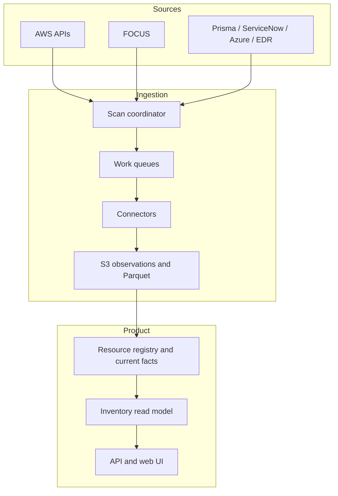
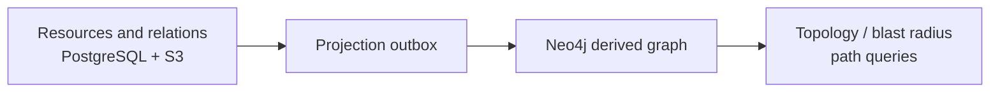

# Architecture cible — Cloud Assurance Platform

> Version greenfield, inventory-first. Ce document définit une cible construite depuis zéro. Il ne suppose aucun système existant, aucun modèle legacy et aucune migration préalable.

---

## 1. Décision exécutive

La Cloud Assurance Platform est un **inventaire cloud enrichi et temporel** qui permet, progressivement, de répondre à cette question :

> Pour chaque ressource cloud attendue, que savons-nous réellement de son état opérationnel, de quelles sources cette information provient-elle, est-elle encore fraîche, et quels écarts doivent être traités ?

La V1 est volontairement simple côté utilisateur :

- une vue d'inventaire AWS filtrable ;
- des colonnes enrichies provenant de plusieurs sources ;
- les tags attendus et leur valeur ;
- le statut SSM ;
- le coût FOCUS ;
- une liste d'écarts à valeur immédiate (« Insights ») dérivés des facts croisés : bases RDS en Extended Support, volumes orphelins, ressources à coût sans owner ;
- une API read-only exposant les mêmes données que l'interface ;
- la capacité d'ajouter ensuite CrowdStrike, Prisma, ServiceNow, Azure Resource Graph, Azure Update Manager ou d'autres sources sans reconstruire le cœur.

Le modèle central n'est ni le coût, ni un finding, ni un graphe. Il est :

```text
Resource → Observations de sources → Facts courants → Vues produit
```

À partir de la V2, cette chaîne s'étend sans rupture :

```text
Resource → Facts → Control Evaluation → Finding → Action → preuve de remédiation
```

La forme retenue est un **monolithe modulaire** déployé sur AWS, avec des workers indépendants par type de connecteur :

- Aurora PostgreSQL pour l'inventaire courant, la configuration SaaS et les read models ;
- S3 + Parquet pour les observations historiques, FOCUS et le rejeu ;
- ECS Fargate pour les collecteurs et traitements ;
- Step Functions pour coordonner un run ;
- SQS pour distribuer les work items et absorber la backpressure ;
- FastAPI pour l'API ;
- Next.js/React pour le frontend.

La V1 n'utilise ni Kubernetes, ni graph database, ni streaming permanent, ni Iceberg. Ces technologies ne sont introduites que lorsqu'un usage et un seuil de charge les justifient.

---

## 2. Positionnement produit et versions

### 2.1 V1 — Inventory & Enrichment Foundation

La V1 prouve deux choses :

1. AWS constitue le squelette de l'inventaire, indépendamment du billing.
2. Des briques de données développées séparément peuvent enrichir cet inventaire sans modifier son modèle central.

Capacités visibles :

- inventaire AWS EC2, EBS, RDS/Aurora, S3, snapshots EBS et AMI (requis par les insights d'orphelins) ;
- filtres par compte, région, type, identifiant, nom et tags ;
- colonnes de tags attendus ;
- statut SSM simple ;
- coût FOCUS rattaché quand le rapprochement est possible ;
- coût non rapproché visible séparément ;
- insights V1 : écarts chiffrés dérivés du croisement inventaire × cycle de vie × coût (cf. 6.11) ;
- fraîcheur et santé des sources ;
- export CSV/Parquet ;
- API publique read-only avec service accounts et scopes (ADR-10) ;
- colonnes configurables par métadonnées.

La V1 n'ouvre pas encore de findings et ne construit pas un modèle universel d'ownership. Un insight n'est pas un finding : il n'a ni assignation, ni SLA, ni workflow.

### 2.2 V2 — Resource 360 & Operational Coverage

Le clic sur une ressource ouvre une vue détaillée :

- configuration cloud ;
- historique de présence et de propriétés ;
- coût ;
- patching SSM ou Azure Update Manager ;
- monitoring ;
- CrowdStrike/EDR ;
- Prisma ;
- correspondance ServiceNow CMDB ;
- relations vers les volumes, interfaces, réseaux, bases ou composants associés ;
- source et date de chaque information.

La V2 introduit les contrôles versionnés et leurs évaluations, mais garde une interface orientée ressource.

### 2.3 V3 — Governance & Controlled Remediation

La V3 introduit :

- findings ;
- assignation et SLA ;
- tickets ServiceNow ou autres ITSM ;
- exceptions expirantes ;
- approbations ;
- actions idempotentes ;
- preuve de remédiation ;
- extensions cloud réellement implémentées.

---

## 3. Principes d'architecture

### 3.1 Infra-first

Une ressource AWS est découverte par les API AWS, même si :

- elle ne génère aucun coût ;
- elle n'apparaît pas dans FOCUS ;
- elle n'est pas taguée ;
- elle n'est connue ni de Prisma, ni de ServiceNow, ni d'un outil de monitoring.

FOCUS ne crée jamais artificiellement une ressource cloud. Une ligne de coût non rapprochée reste un coût non rapproché.

### 3.2 Connecteurs indépendants

Un connecteur ne connaît ni le schéma PostgreSQL interne, ni le frontend. Il produit un contrat versionné commun.

Cela permet à plusieurs développeurs de travailler en parallèle sur :

- AWS Inventory ;
- FOCUS ;
- Prisma ;
- ServiceNow ;
- Azure Resource Graph ;
- Azure Update Manager ;
- CrowdStrike ;
- monitoring et backup.

### 3.3 Valeur, provenance et fraîcheur

La plateforme n'introduit pas de score de confiance numérique en V1.

Chaque valeur expose seulement ce qui est nécessaire :

- sa valeur ;
- sa source ;
- son heure d'observation ;
- son état de vérification.

Les quatre états V1 sont :

```text
KNOWN    valeur connue et fraîche
UNKNOWN  impossible de conclure
STALE    dernière valeur connue trop ancienne
ERROR    source interrogée mais en échec
```

Pour un booléen, `false` n'est produit que lorsque la source et le scope permettent réellement de prouver l'absence. Une absence de donnée devient `UNKNOWN`, jamais `false`.

### 3.4 État courant reconstruisible

L'inventaire courant et les colonnes affichées sont des projections. L'historique d'observation reste conservé sur S3.

Une correction de normalizer ou de règle peut reconstruire les projections sans rappeler les API cloud.

### 3.5 Multi-tenant dès la fondation

Chaque objet, index, contrainte et chemin de stockage contient `tenant_id`. Aucun filtrage tenant ne dépend uniquement du frontend ou d'une convention applicative.

---

## 4. Architecture fonctionnelle



### 4.1 Découpage logiciel

Un seul repository et une seule cadence de livraison, avec des modules stricts :

```text
tenancy
cloud_connections
connector_runtime
resource_registry
observations
resource_facts
fact_registry
reference_catalog
cost_attribution
insights
inventory_serving
source_health
controls              V2
governance_actions    V3
```

Le même code produit plusieurs rôles d'exécution :

- API ;
- worker de collecte ;
- worker de normalisation/projection ;
- worker d'intégration et d'action en V3.

Ce découpage offre l'isolation opérationnelle nécessaire sans créer prématurément des microservices indépendants.

---

## 5. Contrat de connecteur

### 5.1 Contrat commun

Chaque connecteur produit un `ConnectorBatch` :

```text
ConnectorBatch
├── tenant_id
├── source
├── connector_version
├── schema_version
├── source_run_id
├── scope
├── collected_at
├── resources[]          optionnel
├── resource_facts[]     optionnel
├── resource_relations[] optionnel
├── cost_facts[]         optionnel
└── run_status
```

Le connecteur écrit d'abord un batch et son manifeste dans S3. Le cœur valide le batch puis l'ingère. Un connecteur ne fait jamais d'upsert direct dans les tables produit.

### 5.2 Capacités par connecteur

| Connecteur | Resources | Facts | Relations | Costs |
|---|---:|---:|---:|---:|
| AWS APIs | Oui | Oui | Oui | Non |
| FOCUS | Non | Agrégats dérivés | Non | Oui |
| Prisma | Non | Oui | Éventuellement | Non |
| ServiceNow CMDB | Non en V1 | Oui | Éventuellement | Non |
| Azure Resource Graph | Oui | Oui | Oui | Non |
| Azure Update Manager | Non | Oui | Non | Non |
| CrowdStrike | Non | Oui | Non | Non |
| Monitoring | Non | Oui | Relations éventuelles | Non |
| Référentiels (catalog) | Non | Oui (`catalog.*`) | Non | Non |

### 5.3 Resource locator

Les connecteurs externes ne choisissent jamais le `resource_id` SaaS. Ils fournissent un locator :

```text
provider
account_or_subscription
region_or_scope
resource_type
native_id_or_arn
```

Le Resource Registry résout ce locator vers une ressource existante.

Si la résolution échoue :

- le record est conservé ;
- il apparaît dans une file de données non rapprochées ;
- il ne crée pas automatiquement une ressource cloud ;
- aucun rapprochement ambigu n'est exécuté silencieusement.

### 5.4 Namespaces de facts

Chaque source possède son namespace :

```text
aws.tag.Environment
aws.tag.Owner
aws.ssm.managed
aws.ssm.agent_version
aws.rds.engine_version
focus.cost.actual_mtd
focus.cost.amortized_mtd
crowdstrike.sensor.installed
prisma.resource.present
prisma.exposure.public
servicenow.cmdb.present
servicenow.assignment_group
azure.update.patch_state
monitoring.registration.present
```

Deux sources ne partagent pas une clé sémantique par convention implicite.

Trois classes de namespaces coexistent :

- **sources** (`aws.*`, `focus.*`, `prisma.*`…) : observations directes d'une API externe ;
- **`catalog.*`** : référentiels maintenus par la plateforme (cycles de vie, tarifs), ingérés comme des sources versionnées (cf. 6.12) ;
- **`derived.*`** : valeurs calculées par une règle versionnée à partir de facts sources et catalog.

```text
catalog.rds.engine.eol_date
catalog.rds.extended_support.rate
derived.rds.extended_support.tier
derived.rds.extended_support.estimated_monthly_cost
```

Une date EOL n'est jamais publiée sous `aws.*` : elle ne provient pas d'une API AWS.

Si le produit introduit plus tard `operational.owner`, cette valeur est une projection explicite issue d'une règle de résolution versionnée. En V1, `aws.tag.Owner` et `servicenow.assignment_group` restent deux facts distincts.

### 5.5 Contract tests

Chaque connecteur doit passer le même harnais :

- schéma valide ;
- pagination complète ;
- retries idempotents ;
- classification des erreurs ;
- `AccessDenied` distinct de l'absence ;
- timestamps présents ;
- locator normalisé ;
- chaque `fact_key` publié existe dans le FactDefinitionRegistry (6.13) ;
- manifest et checksum valides ;
- aucun accès cross-tenant ;
- golden dataset reproductible.

---

## 6. Modèle de données V1

Le modèle V1 est volontairement réduit. Les concepts V2/V3 ne sont pas introduits avant leur usage.

### 6.1 Tenant et connexions

#### Tenant

```text
tenant_id
name
status
created_at
data_region
```

`data_region` est présent dès la V1, mais une seule région est opérée tant qu'aucune exigence contractuelle payée n'impose la multi-résidence.

#### CloudConnection

```text
tenant_id
connection_id
provider
external_scope_id
role_arn
external_id_ref
enabled
last_verified_at
```

#### SourceConnection

Configuration de FOCUS ou d'une source externe :

```text
tenant_id
source_connection_id
source
configuration_ref
enabled
last_verified_at
```

Les secrets restent dans Secrets Manager ; la base ne conserve qu'une référence.

### 6.2 SourceRun

```text
tenant_id
source_run_id
source
connector_version
scope
scheduled_at
started_at
completed_at
status
completeness_state
manifest_ref
error_summary
```

États de complétude :

```text
COMPLETE
COMPLETE_WITH_GAPS
PARTIAL
PERMISSION_DENIED
SOURCE_UNAVAILABLE
FAILED
```

Un run incomplet reste consultable mais ne prouve jamais une absence.

La complétude n'est pas globale au run : elle est prouvée par scope.

#### SourceRunScope

```text
tenant_id
source_run_id
scope_id
account_or_subscription
region_scope
collector
resource_type
status
pagination_complete
permission_state
observed_count
```

Une absence (`false`, retirement) ne peut être déduite que d'un scope `COMPLETE` avec `pagination_complete` vrai et permissions vérifiées. Les règles de cycle de vie (6.3) s'appuient sur SourceRunScope, jamais sur le statut global du run.

### 6.3 Resource

```text
tenant_id
resource_id
provider
account_or_subscription_id
region_scope
resource_type
native_id
arn_or_provider_path
display_name
first_seen_at
last_seen_at
lifecycle_state
```

`resource_id` est un UUID persistant attribué par le registre. Il n'est ni recalculé depuis les tags, ni exposé comme clé métier au client.

Contrainte d'identité active :

```text
tenant + provider + account/subscription + region_scope
+ resource_type + normalized_native_id + active_incarnation
```

Lorsqu'une identité fournisseur réapparaît après un retirement confirmé, le registre crée une nouvelle incarnation et un nouveau `resource_id`.

Cycle de vie :

```text
ACTIVE
MISSING_SUSPECTED
RETIRED
```

Une ressource ne passe à `RETIRED` qu'après :

- deux scans autoritatifs complets successifs sans la ressource ; ou
- un événement de suppression corroboré par un `NotFound`.

### 6.4 ResourceObservation

```text
tenant_id
observation_id
resource_id
source_run_id
source
observed_at
collected_at
payload_ref
payload_hash
normalizer_version
```

L'objet source allowlisté ou minimisé est conservé sur S3 selon sa classe de rétention. PostgreSQL ne contient que les index nécessaires.

### 6.5 ResourceFactCurrent

```text
tenant_id
resource_id
fact_key
value_type
value_json
verification_state
source
source_connection_id
observed_at
fresh_until
observation_id
updated_at
```

Clé unique :

```text
tenant_id + resource_id + fact_key + source_connection_id
```

La clé porte la **connexion**, pas seulement la source : un tenant peut connecter deux environnements Prisma, deux ServiceNow ou plusieurs outils de monitoring du même type sans écrasement. Plusieurs sources peuvent décrire des concepts proches sans écraser leurs valeurs.

L'historique des facts reste dans Parquet. PostgreSQL conserve le courant nécessaire aux filtres et écrans.

### 6.6 CostFact

Le détail FOCUS reste sur S3/Parquet. Le modèle normalisé contient au minimum :

```text
tenant_id
cost_fact_id
resource_id nullable
source_record_id
billing_period
charge_period
service
charge_category
cost_metric
amount
currency
resource_locator
mapping_status
```

`mapping_status` :

```text
MATCHED
UNMATCHED
AMBIGUOUS
NOT_APPLICABLE
```

PostgreSQL conserve seulement les agrégats nécessaires au produit :

```text
resource_cost_daily
resource_cost_period_summary
unmatched_cost_summary
```

Un coût absent est `UNAVAILABLE`, jamais zéro.

### 6.7 Rapprochement coût–ressource

Le rapprochement FOCUS ↔ ressource est un des problèmes les plus durs de la plateforme. Il est traité comme un module à part entière (`cost_attribution`), avec des règles versionnées et rejouables.

Cascade déterministe, évaluée dans l'ordre, arrêt à la première correspondance non ambiguë :

```text
1. ResourceId FOCUS exact (ARN ou ID natif normalisé)      → MATCHED
2. native_id normalisé + account + region + resource_type  → MATCHED
3. Correspondances multiples                               → AMBIGUOUS
4. Aucune correspondance                                   → UNMATCHED
```

Règles complémentaires :

- un `AMBIGUOUS` n'est jamais résolu silencieusement : il reste visible dans la file des coûts non rapprochés avec ses candidats ;
- les charges non rattachables par nature (support, taxes, crédits, frais de RI/Savings Plans non utilisés) sont classées `NOT_APPLICABLE`, agrégées dans un résumé tenant, jamais réparties en V1 ;
- ressources éphémères : le coût est rattaché à l'incarnation dont la période de vie couvre `charge_period` ; à défaut, `UNMATCHED` avec locator conservé ;
- `actual` et `amortized` sont affichés séparément ; aucune métrique hybride n'est produite ;
- le rapprochement est rejouable : une nouvelle version de règles re-rapproche l'historique FOCUS depuis Parquet sans nouvel ingest ;
- le taux de rapprochement (`matched_rate`) est suivi comme métrique de santé par tenant et par service.

L'allocation des coûts partagés (NAT, transfert, refacturation interne) et tout « showback » sont explicitement hors périmètre tant qu'un chapitre dédié n'a pas été instruit. Aucune promesse commerciale n'est faite sur ces sujets avant.

### 6.8 ResourceRelationCurrent

La relation est incluse dès le modèle, même si elle n'est que peu utilisée dans l'UI V1 :

```text
tenant_id
relation_id
source_resource_id
relation_type
target_resource_id
source
observed_at
fresh_until
observation_id
```

Exemples :

```text
ATTACHED_TO
MEMBER_OF
USES_SECURITY_GROUP
LOCATED_IN_SUBNET
DEPENDS_ON
MONITORED_BY
```

La relation possède sa propre provenance. Elle n'entre jamais dans l'identité d'une ressource.

En V1, `ResourceRelationCurrent` ne relie que des ressources cloud entre elles : `target_resource_id` est obligatoire et référence une Resource. La correspondance CMDB est portée par un fact (`servicenow.cmdb.ci_id`), pas par une relation.

En V2, les objets externes (CI ServiceNow, entités monitoring) deviennent des entités propres :

```text
ExternalObject
  tenant_id
  external_object_id
  source_connection_id
  object_type
  native_id

ResourceExternalLink
  resource_id
  external_object_id
  link_type
  observed_at
```

La projection Neo4j pourra alors représenter Resources et ExternalObjects comme nœuds distincts.

### 6.9 ColumnDefinition

Les colonnes d'inventaire sont décrites par métadonnées :

```text
column_key
label
data_type
source_type
field_or_fact_key
filter_type
sortable
default_visible
stale_after
```

Exemple :

```text
column_key: ssm_managed
label: SSM actif
source_type: fact
field_or_fact_key: aws.ssm.managed
data_type: boolean
filter_type: enum
stale_after: 24h
```

Ajouter un fact compatible peut ainsi produire une nouvelle colonne sans nouveau composant frontend spécifique.

### 6.10 InventoryRowCurrent

Read model reconstruisible :

```text
tenant_id
resource_id
provider
account_or_subscription_id
region_scope
resource_type
display_name
tags_json
facts_json
cost_summary_json
last_seen_at
source_freshness_json
projection_version
```

Les champs structurants conservent des colonnes relationnelles indexées. Les facts dynamiques sont également indexés dans `ResourceFactCurrent` pour éviter de dépendre uniquement de recherches JSONB.

### 6.11 InsightDefinition

Un insight est une règle versionnée évaluée sur les facts courants. Il ne crée ni finding, ni assignation, ni workflow en V1 : il produit une vue filtrée de ressources et, quand c'est calculable, une estimation de valeur (€/mois).

```text
insight_key
label
severity
rule_version
required_facts[]
estimation_formula nullable
enabled
```

Exemples V1 :

```text
rds.extended_support         RDS/Aurora en version EOL payant l'Extended Support
ebs.unattached               Volumes EBS non attachés depuis plus de N jours
ec2.stopped_with_storage     Instances arrêtées conservant des volumes provisionnés
snapshot.orphan              Snapshots sans volume ni AMI associés
tag.owner_missing_with_cost  Ressources à coût non nul sans tag Owner
ssm.agent_missing            EC2 éligibles sans agent SSM
```

`rds.extended_support` illustre la règle générale : croiser un fact source (`aws.rds.engine_version`), les facts catalog (`catalog.rds.engine.eol_date`, `catalog.rds.extended_support.rate`) et le coût FOCUS pour produire des facts `derived.*` et un écart chiffré qu'aucune source seule ne donne.

Contraintes :

- chaque insight expose ses facts d'entrée, leurs sources et leur fraîcheur ;
- un insight fondé sur un fact `STALE` ou `UNKNOWN` est affiché comme non concluant, jamais comme un écart prouvé ;
- l'estimation de valeur cite sa formule et ses hypothèses ;
- les règles d'insight sont du **code versionné** passant le harnais de tests ; aucun DSL générique en V1 (`estimation_formula` référence une fonction, pas une expression configurable) ;
- les référentiels (dates EOL, grilles tarifaires Extended Support, vCPU par classe) sont ingérés via ReferenceDatasetVersion (6.12).

Les insights sont le précurseur direct des contrôles V2 : mêmes facts, mêmes règles versionnées, sans la couche workflow.

#### InsightResultCurrent

Le résultat d'évaluation est matérialisé pour l'API et l'UI :

```text
tenant_id
insight_key
rule_version
resource_id
evaluation_state
estimated_value nullable
currency nullable
value_basis
inputs_digest
evaluated_at
expires_at
```

```text
evaluation_state = MATCH | NO_MATCH | INCONCLUSIVE
value_basis      = ACTUAL | ESTIMATED | MIXED | UNAVAILABLE
```

- une ressource dont un fact requis est `STALE`, `UNKNOWN` ou `ERROR` produit `INCONCLUSIVE`, jamais une disparition silencieuse ;
- `inputs_digest` prouve quels facts, versions de règles et versions de référentiels ont produit le résultat ;
- l'historique des évaluations part dans Parquet.

### 6.12 ReferenceDatasetVersion

Les référentiels (cycles de vie moteurs, paliers et tarifs Extended Support, vCPU par classe d'instance, formules Multi-AZ/replicas) sont des **sources de premier rang**, pas des constantes de code :

```text
dataset_key
version
source_url
published_at
effective_from
effective_to
checksum
ingested_at
```

- chaque version est immuable ; les facts `catalog.*` référencent la version qui les a produits ;
- une nouvelle version de dataset peut déclencher une réévaluation d'insights sans re-scan cloud ;
- un dataset périmé (`effective_to` dépassé sans successeur) dégrade les insights dépendants en `INCONCLUSIVE` ;
- la fraîcheur de ces référentiels est monitorée comme celle d'un connecteur : c'est l'actif produit central du positionnement.

### 6.13 FactDefinitionRegistry

Aucun fact libre : tout `fact_key` publié doit être enregistré.

```text
fact_key
schema_version
value_type
unit nullable
allowed_values nullable
applicable_resource_types[]
default_freshness
producer_namespace
description
deprecated_at nullable
```

Règles :

- un connecteur ne peut publier qu'un `fact_key` enregistré ;
- un changement de type exige une nouvelle `schema_version` ;
- le CI rejette tout fact inconnu (contract tests, 5.5) ;
- toute `ColumnDefinition` référence obligatoirement un FactDefinition ;
- en Phase 0/1, le registre vit comme fichiers déclaratifs dans le repository, validés en CI ; il est promu en table lorsque la configuration par tenant l'exige.

C'est ce registre qui permet réellement aux workstreams AWS, FOCUS, Prisma et Azure de travailler indépendamment.

---

## 7. Frontend V1

### 7.1 Navigation

Quatre surfaces principales :

1. **Inventory**
2. **Insights**
3. **Sources**
4. **Admin**

FOCUS est visible dans l'inventaire et dans un résumé économique ; il ne devient pas une application FinOps parallèle.

### 7.2 Vue Inventory

Fonctions :

- filtres combinables ;
- colonnes configurables ;
- recherche ;
- tri ;
- vues enregistrées ;
- export ;
- indication de fraîcheur ;
- drawer de détail léger.

Colonnes initiales possibles :

```text
Resource
Account
Region
Type
Environment tag
Owner tag
Application tag
Cost MTD
SSM managed
SSM agent version
Last seen
```

CrowdStrike, Prisma ou ServiceNow ajoutent ensuite leurs colonnes via le même mécanisme.

### 7.3 Vue Insights

- liste des insights actifs : ressources concernées (`MATCH`), non concernées (`NO_MATCH`) et impossibles à évaluer (`INCONCLUSIVE`) comptées séparément ;
- valeur réelle (`ACTUAL`) et valeur estimée (`ESTIMATED`) affichées distinctement, jamais additionnées silencieusement ;
- clic sur un insight → Inventory pré-filtré sur les ressources concernées ;
- chaque insight expose sa règle, sa version, les facts utilisés, leurs sources et leur fraîcheur ;
- export CSV par insight ;
- aucun workflow (assignation, ticket, SLA) avant la V3.

Cette vue est l'argument de démonstration du produit : « en deux heures de connexion, voici ce que vous ne saviez pas sur votre parc, et ce que ça vous coûte ».

### 7.4 Sémantique des cellules

| Affichage | Signification |
|---|---|
| Valeur / Oui | Valeur connue et fraîche |
| Non | Absence réellement prouvée |
| Inconnu | Droits, source ou rapprochement insuffisants |
| Périmé | Une ancienne valeur existe mais n'est plus fraîche |
| Erreur | La dernière collecte de la source a échoué |

Un tooltip ou drawer expose source et heure. L'utilisateur n'a pas à comprendre Observation, manifest ou projection pour utiliser la table.

### 7.5 V2 Resource Detail

La page ressource réutilise les mêmes facts :

```text
Overview
Configuration
Tags
Cost
Patching
Monitoring
Security agents
CMDB
Relations
History and sources
```

La V2 n'impose donc aucune refonte du modèle V1.

---

## 8. Traitements, orchestration et résilience

### 8.1 Flux recommandé

```text
EventBridge Scheduler
  → Step Functions crée et coordonne un SourceRun
  → planner produit les WorkItems
  → SQS Standard
  → ECS Fargate worker pool
  → S3 staging + manifest
  → validation et normalisation
  → projection PostgreSQL
  → outbox et rafraîchissement du read model
```

Step Functions ne lance pas un child workflow par ressource ou par page. SQS possède la distribution, les retries et la backpressure.

Distributed Map est réservé aux replays S3 réellement massifs ou aux traitements nécessitant plus de concurrence que le worker pool standard.

### 8.2 Work item

```text
tenant
source_connection
account/subscription
region/scope
connector
operation
partition/chunk
source_run_id
```

La pagination est normalement gérée dans le worker. Un nouveau work item de page n'est créé que si le connecteur a besoin d'une parallélisation contrôlée.

### 8.3 Idempotence

Les IDs techniques sont stables dans un run :

```text
work_item_id   = hash(source_run + scope + operation + chunk)
observation_id = hash(work_item + source_record_key + occurrence)
```

Les redeliveries SQS rencontrent les mêmes contraintes uniques. Aucune dépendance n'est faite à l'ordre des messages.

### 8.4 Gestion des erreurs

| Situation | Comportement |
|---|---|
| `AccessDenied` | Pas de retry infini ; scope non vérifiable |
| Throttling | Backoff jitteré et réduction de concurrence |
| Source indisponible | Dernière valeur devient éventuellement `STALE` |
| Payload malformé | Quarantaine et DLQ |
| Run partiel | Aucune absence et aucun retirement déduits |
| Projection échouée | Run non publié ; rejeu depuis le manifest |

### 8.5 Reprocessing

Un replay :

- lit un manifest et des observations existantes ;
- utilise une nouvelle version de normalizer ou de projection ;
- n'appelle pas AWS ni les sources externes ;
- écrit une nouvelle génération de read model ;
- bascule atomiquement après validation.

Capacités de replay selon rétention :

- ré-extraction depuis le payload source pendant sa rétention ;
- reconstruction depuis les observations normalisées pendant leur rétention ;
- reconstruction du read model depuis les facts et coûts historiques.

---

## 9. Décisions techniques — ADR

### ADR-01 — S3 + Parquet avant Iceberg

**Décision :** S3 pour les batches, manifests et payloads ; Parquet append-only pour l'historique normalisé et FOCUS.

Pas d'Iceberg en V1 car :

- les datasets sont principalement append-only ;
- PostgreSQL sert l'état courant ;
- aucun usage contractuel d'UPDATE/DELETE analytique ou time travel SQL n'existe encore.

**Passage à Iceberg si au moins un besoin durable apparaît :**

- plus de 100 millions de lignes nouvelles par jour ;
- plus de 100 000 fichiers actifs par dataset ;
- writers concurrents sur une même table logique ;
- corrections/suppressions fréquentes ;
- planning de requête supérieur à 10 secondes p95 ;
- maintenance Parquet/manifests supérieure à 0,5 ETP.

### ADR-02 — Aurora PostgreSQL

**Décision :** Aurora PostgreSQL pour le transactionnel, l'isolation tenant, les facts courants et les read models.

Configuration initiale :

- writer ;
- reader dans une autre AZ ;
- PITR ;
- RDS Proxy si les profils de connexion le justifient ;
- RLS forcée ;
- rôle API non-owner et sans `BYPASSRLS`.

**Évolution :** cellules de tenants ou cluster dédié si un tenant représente plus de 20 % de la charge, si le cluster dépasse ses SLO après tuning/replicas, ou si une exigence contractuelle impose un silo.

Seuil spécifique `ResourceFactCurrent` : au-delà d'environ 500 millions de lignes courantes, ou si le rafraîchissement des read models sort de son SLO, partitionner par hash de `tenant_id` et servir l'inventaire uniquement depuis `InventoryRowCurrent` (`facts_json`), `ResourceFactCurrent` étant relégué au filtrage et aux projections. Le mécanisme existe déjà dans le modèle ; seul le déclencheur change.

### ADR-03 — ECS Fargate workers

**Décision :** workers conteneurisés, autoscalés sur l'âge et la profondeur des queues.

Lambda reste réservé aux webhooks et tâches courtes. EKS n'apporte aucun mécanisme nécessaire en V1.

Glue/Spark n'est introduit que pour les gros traitements FOCUS/replay qui dépassent durablement la mémoire d'un worker ou quatre heures de traitement partitionné.

### ADR-04 — Step Functions coordinateur + SQS distributeur

**Décision :** Step Functions coordonne un run ; SQS distribue les unités de travail.

Ce découpage évite :

- un workflow par page ;
- des milliers de tâches Fargate d'une minute ;
- une double logique de retry ;
- un couplage entre orchestration et pagination fournisseur.

### ADR-05 — REST/FastAPI + Next.js, API comme surface produit

**Décision :** API REST versionnée, curseurs de pagination, opérations longues asynchrones, frontend Next.js/React derrière CloudFront.

Le navigateur n'interroge jamais directement S3, Athena ou une source externe.

L'API n'est pas seulement le backend du frontend : c'est une surface produit dès la V1 :

- service accounts avec scopes read-only, quotas et rate limits (ADR-10) ;
- spécification OpenAPI publiée ;
- endpoints inventory, facts, insights et source health identiques à ceux consommés par l'UI ;
- exports asynchrones livrés par URL présignée courte ;
- webhooks (run terminé, nouvel insight) prévus en V2.

Aucun endpoint « privé UI » ne contourne ce contrat : ce que l'interface affiche, un client peut l'extraire par API.

### ADR-06 — Facts namespacés avant modèle universel

**Décision :** chaque connecteur publie des facts namespacés. Aucun `owner`, `security_status` ou `compliance_score` universel n'est imposé en V1.

Une projection sémantique commune n'est ajoutée que lorsqu'un cas utilisateur nécessite réellement de résoudre plusieurs sources.

### ADR-07 — Pas de streaming permanent

**Décision :** batch et micro-batch. Des événements peuvent déclencher un rescan ciblé, mais une réconciliation périodique demeure obligatoire.

Streaming si :

- fraîcheur contractuelle inférieure à cinq minutes pour une part significative des données ;
- plus de 10 000 changements par seconde ;
- ou coût du polling supérieur au traitement événementiel.

### ADR-08 — Pas de graph database en V1, mais graph-ready

**Décision :** les relations courantes sont conservées dans PostgreSQL et leur historique dans Parquet. Neo4j ou un autre moteur de graphe pourra être ajouté comme **projection dérivée**, jamais comme source de vérité.

Seuils d'introduction :

- plus de 50 millions de relations courantes ;
- parcours de plus de cinq sauts dans plus de 20 % des requêtes produit ;
- p95 supérieur à deux secondes après indexation et précalculs ;
- besoin vendu de blast radius, pathfinding, centralité ou dépendances complexes.

### ADR-09 — IA comme couche de consommation, jamais comme source de vérité

**Décision :** aucune inférence IA dans la chaîne d'ingestion, de normalisation ou de projection. L'IA est introduite (V2+) comme couche de consommation au-dessus des read models :

- requête en langage naturel traduite vers les filtres existants de l'Inventory ;
- explication d'un insight ou d'un écart, générée uniquement à partir des facts sourcés ;
- résumé de santé des sources et des runs.

Contraintes :

- toute réponse générée cite les facts, sources et timestamps utilisés ;
- aucune valeur générée n'est écrite dans Resource, Fact ou CostFact ;
- fonctionnalité désactivable par tenant (exigence fréquente en environnement régulé) ;
- aucun envoi de données tenant vers un modèle externe sans accord contractuel explicite.

Le modèle facts + provenance rend cette couche fiable à faible coût : le LLM reformule et met en relation des données prouvées, il n'en produit pas.

Cet ADR ne génère aucun composant en Phase 0/1.

### ADR-10 — Authentification et identités API

**Décision :** aucun token anonyme représentant indistinctement « tout un tenant ». Deux populations distinctes dès la V1 :

```text
Utilisateurs UI
  → OIDC (SAML si exigé contractuellement)
  → membership tenant en base
  → rôles Admin / Viewer

Clients machine
  → service accounts nommés, rattachés au tenant
  → API keys hashées, scopes explicites, expiration et rotation
  → rate limits par service account
  → journal d'accès (identité, tenant, scope, horodatage)
```

OAuth2 client credentials remplace les API keys en V2 si les intégrations clients le demandent. Toute clé sans expiration ou sans scope est rejetée à la création.

### ADR-11 — Requêtage Parquet : DuckDB puis Athena

**Décision :** les replays, agrégats FOCUS et backtests d'insights lisent le Parquet avec **DuckDB embarqué dans les workers**. Aucun cluster de requête dédié en V1.

Athena prend le relais, par traitement, si :

- le dataset scanné dépasse durablement la mémoire d'un worker Fargate ;
- un traitement partitionné dépasse quatre heures (cohérent avec ADR-03) ;
- un besoin d'analytique ad hoc cross-datasets apparaît côté exploitation.

Le navigateur n'interroge jamais DuckDB ni Athena : leurs résultats redeviennent des read models ou des exports.

---

## 10. Trajectoire Neo4j et Azure

### 10.1 Clarification

**Azure Resource Graph** est une source d'inventaire et de requêtes Azure. Ce n'est pas la graph database interne de la plateforme.

Le connecteur Azure Resource Graph produira :

- des `Resource` Azure ;
- des `ResourceFact` Azure ;
- des `ResourceRelation` lorsqu'une relation peut être prouvée.

Azure Update Manager produira principalement des facts de patching rattachés aux ressources Azure existantes.

### 10.2 Pourquoi l'architecture est graph-ready

Quatre décisions garantissent l'évolution :

1. Chaque ressource possède un `resource_id` stable indépendant du stockage.
2. Les relations sont des objets explicites avec type, source et temporalité.
3. Les observations historiques permettent de reconstruire les relations.
4. PostgreSQL et S3 restent canoniques ; un index graphe peut être détruit et reconstruit.

### 10.3 Projection future



Le projector Neo4j utilisera des opérations idempotentes :

```text
Node key     = tenant_id + resource_id
Relation key = tenant_id + relation_id
```

La suppression ou corruption du graphe ne bloque ni la collecte, ni l'inventaire, ni FOCUS, ni l'API principale. Une reconstruction complète repart des relations canoniques.

### 10.4 Isolation et scalabilité du graphe

Au moment de son introduction :

- `tenant_id` obligatoire sur chaque nœud et relation ;
- aucune requête graphe sans contexte tenant ;
- graph projection déployée par cellule SaaS ;
- tenant réglementé ou très volumineux isolable dans une base dédiée ;
- alimentation asynchrone avec watermark et monitoring de lag ;
- aucun dual-write transactionnel entre PostgreSQL et Neo4j.

Cette architecture permet donc l'ajout futur de Neo4j, mais évite de payer et d'opérer un second datastore avant l'existence d'un usage graphe réel.

---

## 11. Sécurité et isolation SaaS

### 11.1 AWS cross-account

Chaque compte client déploie un rôle read-only :

- trust vers un principal SaaS précis ;
- External ID unique par connexion ;
- permissions minimales par capacité ;
- sessions STS courtes ;
- aucune access key permanente ;
- aucun `iam:PassRole`.

Le patching V1/V2 lit les données SSM existantes. Il n'exécute pas de `SendCommand`.

### 11.2 PostgreSQL

- `tenant_id` dans chaque PK et index pertinent ;
- RLS default-deny ;
- `FORCE ROW LEVEL SECURITY` ;
- rôle runtime non-owner, non-superuser, sans `BYPASSRLS` ;
- `SET LOCAL` du tenant dans chaque transaction ;
- secret de migration inaccessible aux tâches API ;
- tests cross-tenant systématiques.

### 11.3 S3

- préfixes tenant ;
- Block Public Access ;
- chiffrement KMS ;
- URLs présignées ciblées et courtes ;
- accès directs génériques interdits ;
- Object Lock seulement pour les classes audit qui le nécessitent contractuellement.

### 11.4 Minimisation

La plateforme n'ingère pas :

- contenu des buckets ;
- données des bases ;
- logs applicatifs complets ;
- mémoire ou disque des workloads ;
- secrets ;
- textes ITSM non nécessaires.

Les emails, hostnames et IP sont classifiés comme données client confidentielles et soumis à une rétention documentée.

---

## 12. Partitionnement et rétention

### 12.1 S3

```text
raw/
  tenant=<id>/source=<source>/collected_date=<date>/run=<id>/

normalized/
  dataset=<name>/tenant=<id>/event_date=<date>/

focus/
  tenant=<id>/billing_period=<period>/charge_date=<date>/
```

Ne pas partitionner par ressource. Les workers écrivent des shards, ensuite compactés selon le volume réel du tenant. La cible de taille de fichier n'est pas imposée aux petits tenants.

### 12.2 PostgreSQL

- tables courantes indexées par tenant et dimensions de filtre ;
- historique volumineux hors base ;
- tables temporelles volumineuses partitionnées mensuellement seulement lorsque nécessaire ;
- aucune partition par tenant créant des milliers de tables.

### 12.3 Rétention par défaut

| Donnée | Rétention |
|---|---:|
| Payload source général | 90 jours |
| Observations normalisées | 13 mois |
| FOCUS détaillé | 13 mois minimum, configurable |
| Read models courants | Tant que le tenant est actif |
| Logs techniques | 90 jours |
| Exports | 7 jours |
| Backups/PITR PostgreSQL | Jusqu'à 35 jours |

Les capacités de replay doivent toujours indiquer jusqu'à quel niveau de source la reconstruction reste possible.

---

## 13. Scalabilité et SLO

### 13.1 Dimensionnement cible

| Dimension | Lancement | Terme |
|---|---:|---:|
| Tenants | 10 | 1 000 |
| Comptes/subscriptions | 100 | Plusieurs milliers |
| Ressources courantes | Jusqu'à 500 k | Plusieurs millions |
| Observations | Dizaines de millions | Milliards sur S3 |
| Connecteurs actifs | AWS + FOCUS | Plusieurs dizaines |

La scalabilité vient de :

- work items partitionnés ;
- queues indépendantes par classe de workload ;
- workers stateless ;
- historique hors PostgreSQL ;
- read models dédiés à l'interface ;
- cellules SaaS lorsque le pool unique atteint ses limites.

### 13.2 SLO pilote

| SLO | Cible |
|---|---:|
| Disponibilité API mensuelle | 99,9 % |
| GET Inventory p95 | < 500 ms |
| Première page d'inventaire | < 2 s après ouverture |
| Fraîcheur AWS standard | 95 % des scopes < 6 h |
| Publication après fin de collecte | p95 < 30 min |
| Onboarding AWS | < 2 h |
| Valeurs avec source et timestamp | 100 % |
| Runs silencieusement incomplets | 0 |
| Fuite cross-tenant | 0 |

La fraîcheur standard de 6 h est un choix de coût, pas une limite d'architecture : un rescan ciblé déclenché par événements (EventBridge cross-account) pourra ramener la fraîcheur sous 15 minutes sur des types critiques en V2, sans changement de modèle (cf. ADR-07). Ce point doit être assumé en avant-vente : pour un usage inventaire/gouvernance, 6 h suffisent ; le temps réel est un choix explicite facturé, pas un défaut caché.

### 13.3 Coût

Ne pas annoncer un coût par compte avant mesure.

Mesurer séparément :

- coût fixe de la cellule ;
- coût variable par run AWS ;
- coût variable FOCUS ;
- coût stockage par million d'observations ;
- coût par connecteur ;
- coût marginal par compte et par tenant.

À quatre runs par jour et 100 comptes, un objectif de 5 € par compte/mois impose un coût variable moyen inférieur à environ 4 € par run pour l'ensemble des 100 comptes, hors coûts fixes. Ce chiffre doit être validé par un benchmark avant engagement commercial.

### 13.4 Observabilité

La plateforme vend de la preuve et de la fraîcheur : ses propres SLO sont instrumentés au même standard que les données servies.

- OpenTelemetry (traces, métriques, logs structurés) sur API, workers et projections ;
- par run : durée, items traités, erreurs classifiées, throttling subi, coût AWS mesuré ;
- par connecteur : taux de succès, complétude par scope, lag entre `collected_at` et publication ;
- par tenant : fraîcheur effective par source, `matched_rate` FOCUS, âge des référentiels catalog ;
- alerting : run silencieusement incomplet (doit rester à zéro), référentiel périmé, lag de projection hors SLO, DLQ non vide ;
- chaque SLO du §13.2 correspond à une métrique exportée, pas à une estimation.

---

## 14. Roadmap d'implémentation

### Phase 0 — Foundation verticale

**Capacité visible :** connecter un compte AWS et voir ses EC2 dans une table simple.

**À construire :**

- tenant et connexion AWS ;
- rôle AssumeRole ;
- SourceRun et SourceRunScope ;
- contrat ConnectorBatch ;
- registre de facts déclaratif (fichiers + validation CI) ;
- Resource Registry ;
- S3 manifests ;
- premier read model ;
- RLS et tests d'isolation ;
- tests de propriété sur incarnations et retirement (la partie la plus subtile du registre).

**Exit :**

- scan rejouable ;
- absence de doublons ;
- `AccessDenied` visible ;
- aucune disparition sur scan partiel ;
- filtres compte/région/type fonctionnels.

**Reporté :** FOCUS détaillé, contrôles, graph, workflow.

### Phase 1 — V1 Inventory + FOCUS + facts + insights

**Capacité visible :** inventaire AWS enrichi par tags, SSM et coût FOCUS, et premiers écarts chiffrés.

**À construire :**

- EC2/EBS/RDS/S3, snapshots EBS et AMI ;
- ResourceFactCurrent (clé par source_connection_id) ;
- connecteur FOCUS développé en parallèle ;
- rapprochement coût-resource (cascade 6.7) ;
- ReferenceDatasetVersion et facts `catalog.*`/`derived.*` (EOL, Extended Support) ;
- insights V1 (règles versionnées sur facts) ;
- InsightResultCurrent avec états `INCONCLUSIVE` ;
- ColumnDefinition ;
- colonnes dynamiques ;
- Source Health ;
- exports ;
- API publique read-only, service accounts et scopes (ADR-10) ;
- filtres sur facts et coûts.

**Exit :**

- ajout d'un nouveau connecteur de démonstration sans migration de Resource ;
- ajout d'une colonne sans nouveau composant frontend spécifique ;
- coût non rapproché visible ;
- `false` distinct de `unknown` ;
- au moins trois insights produisent une estimation chiffrée sur le pilote ;
- 100 comptes dans le SLO ;
- coût par run mesuré.

**Reporté :** findings, owner canonique, patch detail, ServiceNow workflow, Neo4j.

### Phase 2 — V2 Resource 360

**Capacité visible :** cliquer sur une VM et comprendre sa configuration, son coût, son patching et ses enrichissements.

**À construire :**

- Resource Detail ;
- historique ;
- relations ;
- patching SSM/Azure Update Manager ;
- premiers connecteurs Prisma, ServiceNow, CrowdStrike ou monitoring selon pilotes ;
- contrôles versionnés ;
- évaluations explicables ;
- couche IA de consommation (ADR-09) si la demande pilote le confirme.

**Exit :**

- un contrôle composite peut être expliqué source par source ;
- aucun connecteur ne modifie le modèle Resource ;
- aucune jointure ambiguë automatique ;
- source indisponible affichée `STALE` ou `UNKNOWN`.

**Reporté :** remédiation autonome, graphe si seuil non atteint, parité multicloud.

### Phase 3 — V3 Governance, automation et extensions

**Capacité visible :** transformer un écart en travail gouverné et prouver sa résolution.

**À construire :**

- findings ;
- tickets ;
- SLA ;
- exceptions ;
- Action Templates ;
- approbations ;
- rôle write séparé ;
- connecteurs cloud supplémentaires ;
- Neo4j seulement si les usages graphe et seuils sont atteints.

**Exit :**

- actions idempotentes ;
- preuve avant/après ;
- aucune action destructive par défaut ;
- projection graphe reconstructible si activée ;
- même contrat de ressources/facts/relations pour AWS et Azure.

---

## 15. Organisation des développements parallèles

### Workstream Core

- contrats ;
- registry ;
- ingestion ;
- projections ;
- tenancy ;
- API.

### Workstream AWS

- découverte ;
- normalisation ;
- tags ;
- SSM ;
- relations AWS.

### Workstream FOCUS

- ingestion FOCUS ;
- normalisation CostFact ;
- agrégats ;
- rapprochement resource locator ;
- coûts non rapprochés.

### Workstream Frontend

- Inventory ;
- Insights ;
- ColumnDefinition renderer ;
- filtres ;
- Source Health ;
- exports.

Les équipes s'alignent d'abord sur les contrats et golden datasets. Elles ne partagent pas une base par accès direct ou des modèles implicites.

---

## 16. Critères d'acceptation d'un pilote V1

1. Trois à vingt comptes AWS connectés sans access key permanente.
2. Onboarding technique réalisé en moins de deux heures.
3. Inventaire des types supportés concordant à au moins 99 % avec un échantillon indépendant.
4. Aucun doublon après trois replays du même run.
5. Aucun `AccessDenied` affiché comme valeur négative.
6. Chaque cellule enrichie expose source et timestamp.
7. FOCUS fonctionne sans définir l'univers des ressources.
8. Les coûts non rapprochés sont visibles et ne créent pas de fausses ressources.
9. Un connecteur de test ajoute un nouveau fact et une colonne sans changer le modèle Resource.
10. Les filtres Inventory respectent le SLO sur le volume pilote.
11. Zéro fuite entre deux tenants dans API, PostgreSQL et S3.
12. Le coût réel par run AWS et FOCUS est instrumenté.
13. Au moins trois insights chiffrés (ex. Extended Support évitable) sont validés comme exploitables par le client.
14. Toute donnée visible dans l'UI est extractible par l'API publique read-only.
15. La perte d'une source ou d'un référentiel dégrade les insights concernés en `INCONCLUSIVE` visibles ; aucun insight ne disparaît silencieusement.

Critère produit : le client identifie grâce à l'inventaire au moins un ensemble d'écarts ou de trous de visibilité qu'il ne pouvait pas produire de façon fiable auparavant — et au moins un écart dont la valeur en euros dépasse le prix annuel de la plateforme sur son périmètre.

---

## 17. Risques principaux

1. **Construire trop de connecteurs avant de stabiliser le contrat.**
2. **Transformer les facts en EAV incontrôlable sans registry ni namespace.**
3. **Confondre absence et source indisponible.**
4. **Faire de FOCUS le chemin obligatoire pour créer une ressource.**
5. **Créer trop tôt des concepts universels comme owner ou compliance score.**
6. **Ajouter un graphe avant qu'une requête métier ne le nécessite.**
7. **Multiplier les pages au lieu de faire évoluer Inventory et Resource Detail.**
8. **Sous-estimer les coûts de scans et de petits fichiers.**
9. **Vendre l'inventaire au lieu de l'écart chiffré : toute démonstration commence par la vue Insights.**
10. **Laisser vieillir les référentiels externes (EOL, tarifs Extended Support) : un insight faux détruit la crédibilité de tous les autres.**
11. **Construire un moteur de règles générique (DSL) au lieu d'insights en code versionné.**

---

## 18. Conclusion

La V1 est une **fondation d'inventaire enrichi**, pas encore l'intégralité du produit de gouvernance.

Elle doit démontrer :

- qu'AWS définit l'univers des ressources ;
- que FOCUS enrichit cet univers sans le redéfinir ;
- que des développeurs différents peuvent ajouter des connecteurs indépendants ;
- que les nouvelles données deviennent des facts et des colonnes sans modifier le cœur ;
- que le croisement des facts produit des écarts chiffrés qu'aucune source seule ne donne ;
- que la valeur affichée reste sourcée et fraîche ;
- que l'historique permet le rejeu ;
- que les relations sont déjà modélisées pour une future projection graphe.

Cette architecture est compatible avec Neo4j et Azure à terme parce que les identités et relations sont indépendantes des moteurs de stockage. Neo4j pourra être ajouté comme read model spécialisé, alimenté depuis PostgreSQL/S3 et entièrement reconstruisible, sans migration du registre canonique ni dépendance du produit principal au graphe.
