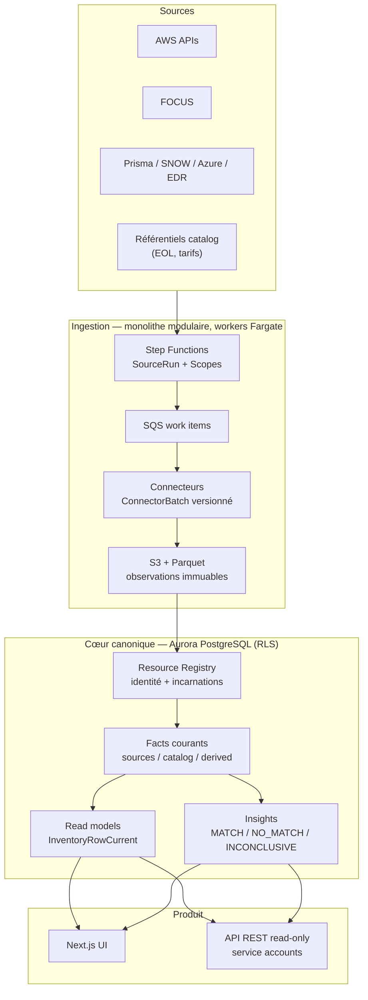

# Résumé — Cloud Assurance Platform

**Inventaire cloud enrichi, temporel et opposable.** Pour chaque ressource attendue : que sait-on
réellement, de quelle source, depuis quand, et quels écarts chiffrés en découlent ?
On ne vend pas l'inventaire, on vend l'écart : « en 2 h de connexion, voici ce que vous ne saviez
pas sur votre parc, et ce que ça vous coûte » (ex. RDS EOL en Extended Support).

## Architecture

## Méthodologie d'architecture appliquée

- **Inventory-first / infra-first** : les API cloud définissent l'univers des ressources ;
  le coût, la sécurité et la CMDB enrichissent, jamais ne créent.
- **ADR à seuils quantifiés** : chaque technologie écartée (Iceberg, Neo4j, streaming, EKS, DSL)
  a un seuil chiffré de réintroduction. Pas de dogme, des déclencheurs.
- **Event-sourcing pragmatique** : observations immuables sur S3, état courant = projection
  reconstruisible sans rappeler les sources.
- **Contract-first** : ConnectorBatch + FactDefinitionRegistry + golden datasets = des équipes
  parallèles sans base partagée ni modèle implicite.
- **Honnêteté épistémique** : `false` seulement si prouvé par un scope complet ;
  sinon `UNKNOWN`. Chaque valeur porte source, timestamp et fraîcheur.
- **Boring technology** : Aurora, S3/Parquet, Fargate, SQS, FastAPI, Next.js, DuckDB.
  La complexité est réservée au domaine, pas à l'infrastructure.
- **Multi-tenant by design** : `tenant_id` partout, RLS forcée, tests cross-tenant, cellules SaaS.

## Concepts clés

| Concept | Rôle |
|---|---|
| `Resource` | Identité stable (UUID + incarnations) ; retirement prouvé, jamais déduit |
| `Observation` | Donnée source immuable, historisée S3/Parquet, rejouable |
| `Fact` | Valeur courante namespacée : `aws.*` (source), `catalog.*` (référentiel), `derived.*` (calculé) |
| `SourceRun / Scope` | Complétude prouvée par compte × région × type ; une absence exige un scope COMPLETE |
| `ReferenceDatasetVersion` | Référentiels versionnés (EOL, tarifs) — l'actif produit central (moat) |
| `FactDefinitionRegistry` | Aucun fact libre ; CI rejette l'inconnu ; anti-EAV |
| `Insight / InsightResult` | Règle en code versionné → écart chiffré ; dégradé en INCONCLUSIVE, jamais disparu |
| `Read model` | Projection dédiée à l'UI/API, reconstruisible, bascule atomique |
| États de valeur | `KNOWN / UNKNOWN / STALE / ERROR` — l'ignorance est affichée, pas masquée |

## Trajectoire

- **V1** — Inventaire AWS + FOCUS + insights chiffrés + API read-only. Preuve : 3 insights > prix.
- **V2** — Resource 360, contrôles versionnés, connecteurs sécurité/ITSM, couche IA ([ADR-09](../adr/ADR-09-ai-as-consumption-layer.md)).
- **V3** — Findings, SLA, remédiation prouvée, Azure en parité, Neo4j si seuils atteints.

Chaque extension (Storage Lens, CrowdStrike, Azure…) = un connecteur + des facts + des colonnes,
zéro modification du cœur. C'est le critère d'acceptation n°9, testé dès le pilote.
